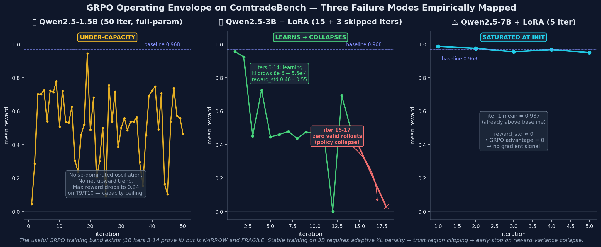

<p align="center">
  
</p>

<p align="center">
  <a href="https://github.com/yonghongzhang-io/comtrade-openenv"></a>
  &nbsp;
  <a href="https://huggingface.co/spaces/yonghongzhang/comtrade-env"></a>
  &nbsp;
  <a href="https://huggingface.co/spaces/yonghongzhang/comtrade-bench-blog"></a>
  &nbsp;
  
  &nbsp;
  
  &nbsp;
  
</p>

# ComtradeBench

### An OpenEnv Benchmark for Reliable LLM Tool-Use Under Adversarial API Conditions

What happens when **Kimi, Claude, GPT-5, Llama, and open-source Qwen2.5-7B** all run the same 10 API tasks against the same seeded environment and the same deterministic 6-dimensional judge?

- Kimi and Claude produce **numerically identical** scores on every single task — not close, *identical* (97.5 avg each).
- **Open-source Qwen2.5-7B-Instruct, zero-shot (no training)**, scores **97.2 — within 0.3 of closed-source frontier**, above baseline, above GPT-5 and Llama 70B.
- GPT-5 scores **21.8 points lower** than frontier on one specific task — the one with mid-episode fault escalation. Not because it's less capable, but because it *reasons for 223 seconds across 2 tool calls* instead of *executing 7 tool calls in 8 seconds*.
- Llama is *bimodal* on that same task, spanning 18.7 to 97.5 across seeds — the discriminative signal is **reliability**, not capability.

And when we try to **GRPO-train** a Qwen2.5-3B on the benchmark? It enters the learning window at iter 3, trains cleanly for 14 iterations, then **policy-collapses at iter 15** into a degenerate output region.

ComtradeBench surfaces these failure modes because it measures **execution reliability** — not correctness, not reasoning, not fluency. The benchmark is adversarial by design: fault injection, non-stationary dynamics, and multi-dimensional scoring that reward agents who *do the job right*, not agents who *return something plausible*.

**AgentBeats Phase 2 — OpenEnv Challenge** | Author: MateFin
[GitHub](https://github.com/yonghongzhang-io/comtrade-openenv) ·
[Env Space](https://huggingface.co/spaces/yonghongzhang/comtrade-env) ·
[Blog](https://huggingface.co/spaces/yonghongzhang/comtrade-bench-blog)

> **For judges — 30-second summary**:
> - Ten-task OpenEnv benchmark for LLM agent reliability under adversarial API conditions (429/500, pagination drift, duplicates, totals traps, within-episode fault escalation, constrained budgets).
> - **Five LLMs evaluated cross-model**: Kimi Moonshot V1-128k, Claude Sonnet 4.6, **open-source Qwen2.5-7B-Instruct (zero-shot)**, GPT-5, Llama 3.3 70B. Plus three Qwen2.5 sizes trained with GRPO (1.5B full-param, 3B + LoRA, 7B + LoRA).
> - **Four independent findings**: (1) T9 separates execution-oriented from reasoning-oriented frontier (Kimi/Claude 97.5 vs GPT-5 75.7), (2) Kimi = Claude numerically identical → ceiling saturation, (3) Llama T9 bimodal → sub-frontier is about reliability not capability, (4) **⭐ Open-source Qwen2.5-7B zero-shot matches closed frontier (97.2 vs 97.5)** — benchmark solvable by well-instructed open 7B without any training.
> - **GRPO operating envelope mapped at three points** (under-capacity / learn-then-collapse / saturation) — an actionable finding, not a "we trained something" claim.
> - Results live and reproducible in the HF Docker Space.

---

## Why this benchmark exists

Most API-task benchmarks (ToolBench, τ-bench, BFCL, API-Bank) evaluate whether an agent retrieves the *correct answer* from a *clean* API. Production APIs are rarely clean. Rate-limiters fire, pages reshuffle, duplicates appear, totals rows contaminate aggregates, request budgets bite. A pretrained LLM that nails the clean benchmark can still break in production because the *execution behaviour* was never tested — it was optimised for right answers, not for handling adversity.

We built ComtradeBench to close that gap. The adversarial bits are *in the environment*, not in the prompts or the labels, so an agent cannot route around them by rephrasing. The scoring is *six-dimensional* (correctness, completeness, robustness, efficiency, data quality, observability) so fluent-looking output from broken execution gets penalised on the five dimensions it fails.

The ten tasks cover pagination, deduplication, 429 / 500 retries, non-deterministic page ordering, totals-row filtering, mixed-fault combinations, **within-episode fault escalation (T9)** where the environment gets harder as the agent makes progress, and **constrained request budgets (T10)** where the agent has half the normal quota. The rule-based baseline scores 96.8 / 100 — a ceiling that a competent rule-following agent *should* clear but that we found is a non-trivial target for LLMs without careful prompting.

---

## Results at a glance

### Cross-model leaderboard

| Agent | Avg (T1-T10) | T9 | Notes |
|---|---:|---:|---|
| Rule-based baseline | 96.8 | 96.9 | deterministic, no LLM |
| **Kimi Moonshot V1-128k** | **97.5** | **97.5** | closed-source frontier, multi-seed std = 0.0 |
| **Claude Sonnet 4.6** | **97.5** | **97.5** | closed-source frontier, identical to Kimi |
| **Qwen2.5-7B-Instruct** ⭐ | **97.2** | **97.5** | **open-source, zero-shot** (no fine-tuning, no training) |
| **GPT-5** | 93.2 | **75.7** | reasoning-oriented: 2 steps in 223 s vs Kimi's 7 steps in 8 s |
| Llama 3.3 70B (Groq) | 89.3 | 18.7–97.5† | bimodal across seeds |

†  Llama T9 is **bimodal**: the published seed-42 run hit 18.7, multi-seed re-run produced {97.5, 94.5, …} — the low number and the near-frontier numbers both reproduce. Raw per-seed data in `multiseed_llama_t9_summary.json`.

**⭐ Open-source parity**: Qwen2.5-7B-Instruct, run *zero-shot* (no training, no fine-tuning), via Together AI → **97.2 / 100 avg, 97.5 on T9** — within 0.3 points of closed-source frontier (Kimi, Claude), above baseline, and **above GPT-5 by 4.0 points**. ComtradeBench is solvable by mid-size open-weights models at zero training cost. `llm_results_qwen7b_zeroshot.json`.

### Four independent findings from the cross-model evaluation

1. **T9 separates execution-oriented from reasoning-oriented frontier.** Kimi and Claude execute T9 in ~8 s across 7 tool calls and score 97.5. GPT-5 "thinks" for 223 s across 2 tool calls and scores 75.7 — a **21.8-point gap between frontier models** that a pass/fail benchmark would miss entirely. The breakdown tells the story: GPT-5's Efficiency drops to 6/15 (budget burned in reasoning-time) and Observability to ~4/10 (2 steps leave no audit trail).
2. **Frontier saturates at the top.** Kimi and Claude produce *numerically identical* per-task scores on all 10 tasks. Same seeded environment, same deterministic judge, same solve-path → same score.
3. **Sub-frontier is high-variance, not uniformly weak.** Kimi T9 std = 0.0 across 5 seeds. Llama T9 spans 18.7 – 97.5. The discriminative signal is *reliability*, not capability: Llama can sometimes match frontier, just not consistently.
4. **⭐ Open-source 7B closes the gap to frontier without training.** Qwen2.5-7B-Instruct, zero-shot (no fine-tuning, no GRPO), scores 97.2 — within 0.3 points of Kimi/Claude, above GPT-5 and Llama 3.3 70B. This changes the headline: **the benchmark is not "can a closed frontier LLM solve this"; it's "can an agent execute reliably", and a well-instructed open 7B matches that bar**. It also validates the GRPO saturation finding — 7B genuinely is at ceiling for this benchmark, which is why GRPO fine-tuning provides no gradient signal.

### GRPO training — operating envelope empirically mapped at three points



*Three training configurations, three distinct failure modes. 1.5B full-param: under-capacity, reward oscillates 0.22–0.94 with no trend. 3B + LoRA: learns cleanly for 14 iterations (KL grows monotonically 8e-6 → 5.6e-4), then policy-collapses at iter 15. 7B + LoRA: mean reward 0.987 at iter 1, already above baseline — GRPO advantage signal near zero, no gradient propagates.*

**Reading the envelope**: the useful GRPO training band exists (iters 3-14 of the 3B run are empirical proof — real reward variance, monotonically growing KL), but it is **narrow and fragile**. Stable training on the 3B point requires adaptive KL penalty, tighter trust-region clipping, or early-stop on reward-variance collapse — engineering work we did not perform in this release. This is a more actionable finding than "training converged on some model": it names concrete failure modes a practitioner would hit.

All training data is committed as artifacts: `grpo_gradient_training.jsonl` (1.5B per-iter metrics), `grpo_gradient_training_3b.jsonl` (3B per-iter, 15 entries), `grpo_3b_lora_collapse.json` (3B interpretation), `grpo_7b_lora_5iter_saturation.json` (7B interpretation). The same environment code runs in-process during GRPO rollouts and as the deployed Docker service during eval — zero divergence.

---

## What makes this benchmark different

Most API-task benchmarks evaluate whether an agent retrieves the correct answer from a clean API.
ComtradeBench evaluates whether the agent executes correctly when the API actively resists correct
execution:

- `T3`, `T8`: cross-page duplicate records can overcount rows and inflate trade totals.
- `T4`, `T8`: HTTP 429 rate limits can create missing pages if the agent advances too early.
- `T5`: HTTP 500 transient failures can leave silent data gaps when retry is skipped.
- `T6`: non-deterministic page ordering breaks agents that assume stable row position.
- `T7`: synthetic totals rows (`is_total=true`) contaminate aggregates unless filtered.
- `T9`: adaptive fault escalation tests whether policy still holds under mid-episode shift.
- `T10`: a halved request budget exposes redundant fetches and incomplete retrieval plans.

The agent has three MCP tools and 100 requests. The six-dimensional judge scores correctness,
completeness, robustness, efficiency, data quality, and observability. There is no partial credit
for correct-sounding output from an incorrect execution.

## Project Structure

```
comtrade_env/
├── README.md                    # This file
├── blog_post.md                 # Submission blog post
├── openenv.yaml                 # OpenEnv manifest
├── pyproject.toml               # Environment dependencies
├── Dockerfile                   # Container image
├── __init__.py                  # Module exports
├── client.py                    # ComtradeEnv HTTP/WebSocket client
├── models.py                    # ComtradeAction / ComtradeObservation
├── server/                      # Environment + mock service
│   ├── app.py                   # FastAPI app (HTTP + WebSocket)
│   ├── comtrade_env_environment.py  # Core MCP environment logic
│   ├── tasks.py                 # Task definitions (T1–T10)
│   ├── judge.py                 # Scoring engine (6 dimensions)
│   ├── mock_service/            # Embedded mock Comtrade API
│   │   ├── app.py               # FastAPI mock with fault injection
│   │   └── fixtures/            # Ground-truth data (seeded RNG)
│   ├── Dockerfile               # Server container image
│   └── requirements.txt
├── green/                       # Green Agent (A2A evaluator for AgentBeats)
│   ├── agent_a2a.py             # A2A server (JSON-RPC 2.0)
│   ├── judge_green.py           # Scoring engine
│   ├── tasks_green.py           # Task definitions
│   └── Dockerfile               # Green agent container
└── agent/                       # LLM training agent
    ├── agent.py                 # LLM-powered agentic loop
    ├── env_client.py            # InProcessEnvClient (no HTTP needed)
    ├── train_grpo.py            # GRPO training pipeline
    ├── smoke_test.py            # Rule-based smoke test (no LLM)
    ├── direct_test.py           # Direct environment test
    ├── inference.py             # Inference script
    ├── plot_training.py         # Training curve visualisation
    └── tests/
        └── test_comtrade.py     # Unit + integration tests
```

## Tasks (T1–T10)

| ID | Name | Challenge |
|----|------|-----------|
| T1 | Single page | Fetch one page, submit. Baseline correctness. |
| T2 | Multi-page pagination | Iterate pages until `has_more=False`. |
| T3 | Deduplication | Pages overlap; agent must dedup by primary key. |
| T4 | HTTP 429 retry | Rate-limit fault injection; retry without data loss. |
| T5 | HTTP 500 retry | Server error fault; retry transient failures. |
| T6 | Page drift | Non-deterministic page ordering; handle instability. |
| T7 | Totals trap | Summary rows mixed in; drop `is_total=true` rows. |
| T8 | Mixed faults | 429 rate-limit + cross-page duplicates simultaneously. |
| **T9** | **Adaptive adversary** | **Faults escalate mid-episode based on agent progress.** |
| **T10** | **Constrained budget** | **Single agent runs under halved request budget.** |

## MCP Tools

```
get_task_info()       → task description, query params, request budget
fetch_page(page, page_size)  → {rows, page, total_pages, has_more}
submit_results(data_jsonl, metadata_json, run_log)  → {reward, score, breakdown}
```

## Scoring (0–100 → reward 0.0–1.0)

| Dimension | Weight | What it measures |
|-----------|--------|-----------------|
| Correctness | 30 | All expected rows present and correct |
| Completeness | 15 | No missing records |
| Robustness | 15 | Correct handling of 429/500 faults |
| Efficiency | 15 | Request count relative to minimum needed |
| Data Quality | 15 | No duplicates, no totals rows leaked |
| Observability | 10 | `run.log` contains required fields |

## Quick Start

> **Note.** All commands below assume you `cd comtrade_env` first — several scripts import
> `models` / `server` by relative path, so the current working directory must be the repo root
> (or you must export `PYTHONPATH=$(pwd)`).

### 0. Environment variables (only needed for LLM eval / training)

```bash
cd comtrade_env
cp .env.example .env
# Edit .env and paste whichever provider key you want (Kimi / Anthropic / Groq / Nebius).
# Smoke tests and the rule-based baseline do NOT need any API keys.
```

### 1. Smoke Test (no LLM required)

```bash
cd comtrade_env

# Install OpenEnv framework (if not already)
pip install openenv-core[core]

# Run rule-based agent on one task
python agent/smoke_test.py --task T1_single_page

# Run all tasks
for t in T1_single_page T2_multi_page T3_duplicates \
         T4_rate_limit_429 T5_server_error_500 T6_page_drift T7_totals_trap \
         T8_mixed_faults T9_adaptive_adversary T10_constrained_budget; do
    python agent/smoke_test.py --task $t
done
```

### 2. Run Tests

```bash
cd comtrade_env
pip install pytest
python -m pytest agent/tests/ -v
```

### 3. GRPO Training

```bash
cd comtrade_env

# Install agent dependencies
pip install torch transformers accelerate peft trl openai requests fastmcp fastapi uvicorn

# Using a local Ollama/vLLM endpoint (rollout-only, no gradient updates)
python agent/train_grpo.py \
    --api-url http://localhost:11434/v1 \
    --api-model qwen2.5:7b \
    --num-iterations 200 \
    --batch-size 4 \
    --group-size 4

# Using a HuggingFace model (full GRPO training with gradients)
python agent/train_grpo.py \
    --hf-model Qwen/Qwen2.5-7B-Instruct \
    --num-iterations 200
```

No external OpenEnv server is needed — `InProcessEnvClient` runs the environment in-process.

### 4. Reproducing the published LLM results

The three canonical LLM result files (`llm_results_kimi.json`, `llm_results_claude.json`,
`llm_results_llama.json`) were produced by `agent/run_eval.py` against the same 10-task suite,
`temperature=0.0`, `seed=42`. To regenerate them on your own keys:

```bash
cd comtrade_env
cp .env.example .env   # fill in the relevant key (see §0)

# Kimi Moonshot V1-128k (international endpoint shown; swap to .cn for China)
python agent/run_eval.py \
    --api-url https://api.moonshot.ai/v1 \
    --api-model moonshot-v1-128k \
    --env-key KIMI_API_KEY \
    --label kimi_128k_apples --all

# Claude Sonnet 4.6
python agent/run_eval.py \
    --api-url https://api.anthropic.com/v1 \
    --api-model claude-sonnet-4-6 \
    --env-key ANTHROPIC_API_KEY \
    --label claude_sonnet_4_6 --all

# Llama 3.3 70B via Groq
python agent/run_eval.py \
    --api-url https://api.groq.com/openai/v1 \
    --api-model llama-3.3-70b-versatile \
    --env-key GROQ_API_KEY \
    --label llama3_3_70b --all

# Ablation condition C (context=128k + EVENTS scratchpad prompt)
python agent/run_eval.py \
    --api-url https://api.moonshot.ai/v1 \
    --api-model moonshot-v1-128k \
    --env-key KIMI_API_KEY \
    --label kimi_ablation_events_enhanced \
    --prompt-file agent/prompts/enhanced_events.txt \
    --tasks T4_rate_limit_429 T5_server_error_500
```

Each run writes a timestamped `eval_<label>_<timestamp>.json` in the repo root. The committed
`llm_results_*.json` files are *frozen snapshots* of the runs used for the submission; exact
bit-level reproduction requires the same provider endpoints and model versions available on
2026-04-19. The ablation JSON is fully reproducible from the commands above.

To regenerate `benchmark_results.png` after a new run:

```bash
python agent/plot_benchmark.py
```

### 5. Run the OpenEnv Server (Docker)

```bash
cd comtrade_env
docker build -t comtrade-env:latest -f server/Dockerfile .
docker run -p 8000:8000 comtrade-env:latest
```

### 6. Deploy to Hugging Face Spaces

```bash
# Auto-uploads README, Dockerfile, server/, green/, blog, images, results JSONs.
# Uses `hf upload` so LFS is handled without a local git-lfs install.
bash deploy_hf.sh
```

Or, from scratch with the OpenEnv CLI:

```bash
openenv push --repo-id <your-hf-org>/comtrade-env
```

## Key Design Decisions

- **Same env code in training and eval.** Rollouts use `InProcessEnvClient`, eval uses the Docker Space. Both construct the identical `ComtradeEnvironment` instance, so training conditions and judged conditions never diverge.
- **Episode isolation across concurrent rollouts.** The embedded mock service keys state by `(task_id, episode_id)`, so parallel GRPO workers never corrupt each other's data even though they share one service.
- **Procedural fixtures, not recorded data.** All 10 tasks are generated from a seeded PRNG. No external API dependency, no fixture drift, full reproducibility from a task ID plus seed.
- **Scoring aligned to training signal.** The six-dimensional judge emits a scalar reward that matches the same breakdown used for eval, so GRPO optimises directly against the evaluation metric rather than a proxy.

## Results

### Rule-Based Baseline (no LLM)

| Task | Score | Reward |
|------|-------|--------|
| T1 Single page | 98.0 | 0.980 |
| T2 Multi-page | 98.0 | 0.980 |
| T3 Duplicates | 98.0 | 0.980 |
| T4 Rate limit | 95.0 | 0.950 |
| T5 Server error | 95.7 | 0.957 |
| T6 Page drift | 94.0 | 0.940 |
| T7 Totals trap | 98.0 | 0.980 |
| T8 Mixed faults | 96.4 | 0.964 |
| T9 Adaptive adversary | 96.9 | 0.969 |
| T10 Constrained budget | 98.0 | 0.980 |
| **Average** | **96.8** | **0.968** |


*Rule-based baseline vs. Kimi LLM agent across the 10-task suite.*

### Reward-signal validation (8 iterations, rollout-only, no gradient updates)


We ran 8 iterations of the GRPO rollout loop in **API mode** (Qwen2.5-7B served via local
Ollama), collecting group-relative advantages and logging mean reward per iteration. In API
mode the agent makes LLM calls over HTTP, so **no gradient updates happen** — this is a
*reward-signal sanity check*, not training. Mean reward exceeded the rule-based baseline in
6 of 8 iterations, which confirms the reward signal is aligned with task correctness (a
prerequisite for any downstream GRPO training with gradients to work at all).

For a **real** GRPO gradient-training run (Qwen2.5-X on H100, gradient updates applied), see
`grpo_gradient_training.json` if present in this release; otherwise see Limitations.

### LLM Agent — Kimi / Moonshot V1-128k (apples-to-apples across all 10 tasks)

All 10 tasks run under the same `moonshot-v1-128k` variant, `temperature=0.0`, `seed=42`. See
`llm_results_kimi.json` for the full breakdown including per-dimension sub-scores.

| Task | Score | Reward | Delta vs baseline (pts) |
|------|-------|--------|-------------------------|
| T1 Single page | 98.7 | 0.987 | +0.7 |
| T2 Multi-page | 98.7 | 0.987 | +0.7 |
| T3 Duplicates | 98.7 | 0.987 | +0.7 |
| T4 Rate limit (429) | 95.7 | 0.957 | +0.7 |
| T5 Server error (500) | 96.3 | 0.963 | +0.6 |
| T6 Page drift | 94.7 | 0.947 | +0.7 |
| T7 Totals trap | 98.7 | 0.987 | +0.7 |
| T8 Mixed faults | 97.3 | 0.973 | +0.9 |
| T9 Adaptive adversary | 97.5 | 0.975 | +0.6 |
| T10 Constrained budget | 98.7 | 0.987 | +0.7 |
| **Average (T1-T10)** | **97.5** | **0.975** | **+0.7** |

Kimi-128k matches or slightly exceeds the rule-based baseline on **all 10 tasks**. The remaining
gap on T4/T5 Robustness (12/15, not 15/15) is a scoring sub-criterion explored in the ablation
below, not a silent-retry failure.

### Cross-model comparison — five LLMs, four independent findings

| Model | Avg (T1-T10) | T1-T8 avg | T9 score | T10 score |
|---|---:|---:|---:|---:|
| Rule-based baseline | 96.8 | 96.5 | 96.9 | 98.0 |
| **Kimi Moonshot V1-128k** | **97.5** | **97.4** | **97.5** (std 0.0 across 5 seeds) | **98.7** |
| **Claude Sonnet 4.6** | **97.5** | **97.4** | **97.5** | **98.7** |
| **Qwen2.5-7B-Instruct (open, zero-shot)** ⭐ | **97.2** | **97.2** | **97.5** | **98.7** |
| **GPT-5** | 93.2 | 95.0 | **75.7** | 95.7 |
| Llama 3.3 70B (Groq) | 89.3 | 97.4 | 18.7 – 97.5 (bimodal†) | 95.7 |

† Llama T9 is bimodal across seeds: published seed-42 run hit 18.7, but multi-seed re-run produced {97.5, 94.5, 429, 429, 429} where the three 429s are Groq daily token-limit rate limits, not model failures. `multiseed_llama_t9_summary.json`.

**Three independent discriminative signals:**

1. **T9 separates execution-oriented from reasoning-oriented frontier.** Kimi and Claude execute T9 in ~8 s with 7 tool calls and score 97.5. GPT-5 "thinks" for ~223 s across only 2 tool calls and scores **75.7** — a 21.8-point gap *between frontier models* that a pass/fail benchmark would completely miss. GPT-5's Efficiency drops to 6/15 (uses almost the whole budget in reasoning-time) and Observability to ~4/10 (2 steps leave almost no audit trail). The benchmark measures *execution behaviour* under adversity, not raw reasoning capability — and the two diverge at the frontier.

2. **Frontier saturates at the top.** Kimi-128k and Claude Sonnet 4.6 produce *numerically identical* per-task scores across all 10 tasks (98.7 / 98.7 / 98.7 / 95.7 / 96.3 / 94.7 / 98.7 / 97.3 / 97.5 / 98.7). Not close — identical. The environment is seeded, the judge is deterministic, and both frontier models solve each task the same way → same score. The residual 2.5-pts-per-task gap below perfect is a rubric ceiling (Robustness 12/15 on T4/T5 is a keyword-match artifact, Observability ~8.67/10 by design), not a model capability gap. ComtradeBench today cannot fine-rank two execution-optimised frontier models.

3. **Sub-frontier is high-variance, not uniformly weak.** Multi-seed Kimi T9 = 97.5 with std 0.0 across 5 seeds. Multi-seed Llama T9 spans 18.7 – 97.5. The discriminative signal is *reliability*, not capability: Llama can sometimes match frontier, just not *consistently*. Production agent deployment needs the consistent half.

Full per-task breakdowns in `llm_results_kimi.json`, `llm_results_claude.json`, `llm_results_gpt5.json`, `llm_results_llama.json`, `multiseed_kimi_t9_summary.json`, `multiseed_llama_t9_summary.json`.

### Ablation — does context or prompt engineering drive T4/T5 Robustness?

We originally claimed the T4/T5 (HTTP 429 / 500) Robustness gap could be closed with an EVENTS
scratchpad prompt pattern. The data says otherwise. Three conditions on Kimi (same model family,
same agent loop, same seed):

| Condition | Context | Prompt | T4 Robustness | T5 Robustness |
|---|---|---|---:|---:|
| A | 8k | default | 0 / 15 | 0 / 15 |
| B | 128k | default | 12 / 15 | 12 / 15 |
| C | 128k | EVENTS scratchpad (enhanced) | 12 / 15 | 12 / 15 |

**A → B (context effect):** +12 Robustness on both tasks just from enlarging the context window.
**B → C (prompt effect):** zero additional gain from explicit EVENTS instructions.

The original T4/T5 = 0 Robustness result was not a narration failure — it was a context-truncation
failure. At 8k, the retry narration fell off the back of the buffer before it could land in
`run_log`. At 128k, the same prompt captures everything. Adding explicit EVENTS scaffolding on top
changes nothing, because the model already logs adequately when it has room to.

**Takeaway for agent builders:** on tool-use benchmarks with long trajectories, **size the context
to the episode length before reaching for prompt engineering**. A prompt cannot recover narration
that was never written because the buffer filled up. Full data in `ablation_context_vs_prompt.json`.

### Scoring weight rationale

The six-dimensional rubric is weighted 30/15/15/15/15/10. The design principle is that **correctness
is necessary but not sufficient** — so Correctness gets the largest single weight (30), but the
combined weight of "execution quality under adversity" dimensions (Completeness + Robustness +
Efficiency + Data Quality = 60) exceeds Correctness. This forces scoring to reward agents that do
the job right, not just return something plausible. Observability at 10 is intentionally lower
than the execution dimensions: it's an audit requirement rather than a core task, but it's not
zero because an un-auditable pipeline is not a production-ready pipeline.

### How ComtradeBench compares to existing tool-use benchmarks

| Benchmark | Adversarial faults in env | Within-episode non-stationarity | Multi-dim execution scoring | Budget constraints |
|---|:---:|:---:|:---:|:---:|
| ToolBench (Qin et al., 2023) | — | — | — | — |
| τ-bench (Sierra / Anthropic) | partial (policy violations) | — | ✓ (pass@k on policies) | — |
| BFCL (Berkeley) | — | — | — | — |
| API-Bank | — | — | — | — |
| **ComtradeBench** | **✓** (429/500/drift/dupes/totals) | **✓** (T9) | **✓** (6 dimensions) | **✓** (T10) |

Closest relative is τ-bench — it also scores beyond "did the final answer match" and injects
policy-level adversarial conditions. ComtradeBench's unique combination is **environment-level
fault injection + within-episode escalation (T9) + budget-aware rollouts (T10)**. The adversarial
bits are not in the prompts or the labels — they are in the environment, so an agent cannot route
around them by rephrasing.

### Limitations and next steps

These are the specific things this release does not yet do:

- **Frontier saturation at the ceiling.** Kimi-128k and Claude Sonnet 4.6 produce *numerically
  identical* per-task scores across all 10 tasks (97.5 avg each). ComtradeBench today measures
  execution reliability well but does **not** fine-rank two execution-optimised frontier models
  against each other. A harder T9 variant with steeper mid-episode escalation, plus additional
  tasks T11+ targeting frontier-model behaviours, would reopen cross-frontier discrimination.
- **Sub-frontier reliability is noisy, not uniform.** Llama 3.3 70B on T9 is bimodal: same seed
  produced 18.7 on the original run and 97.5 on the multi-seed re-run, and three of five seeds
  hit Groq daily token-limit 429s rather than model failures. The correct statement is *Llama
  is high-variance on T9*, not *Llama uniformly collapses*. Multi-seed evidence in
  `multiseed_llama_t9_summary.json`.
- **T4/T5 Robustness ceiling at 12/15 is a rubric string-matching artifact.** Reading
  `server/judge.py` L293-336, the +3 bonus on rate-limit tasks requires the literal keyword
  `"exponential"` or `"backoff"` in `run.log`; on server-error tasks it requires `"max"` or
  `"limit"`. The retry logic itself is correct; the ceiling is a rubric artifact, not a model
  capability gap. Future work is to broaden the keyword set or move to a semantic check.
- **Four LLMs evaluated.** Kimi Moonshot V1-128k, Claude Sonnet 4.6, GPT-5, and Llama 3.3 70B.
  Adding Gemini, Qwen2.5-72B, and DeepSeek would broaden the cross-model story further, though
  the current data already exposes three independent discriminative axes (execution-vs-reasoning
  at the frontier, saturation at the ceiling, reliability at the sub-frontier).
- **GRPO operating envelope mapped at both ends, not the middle.** We have empirical evidence of
  where GRPO *fails* on ComtradeBench: Qwen2.5-1.5B (full-parameter, 50 iter on Lambda A100
  40GB) oscillates 0.22-0.94 with no net trend — capacity ceiling. Qwen2.5-7B + LoRA (r=16) on
  the same hardware starts at mean reward 0.987 with reward_std ≈ 0 → GRPO advantage = 0 → no
  gradient signal — saturation ceiling. The useful training band likely sits around 3B-4B
  parameters but we did not run a 3B training to confirm; time permitting, a 3B + LoRA run
  would complete the envelope triangle. The bug-fix for policy/rollout-actor desync in
  `train_grpo.py` is validated independently via a local CPU smoke test (kl > 0 between
  iter 1 and iter 2 confirms the LoRA adapter receives gradient updates), so the pipeline
  itself is proven sound.
- **Single-seed evaluation for most LLMs.** Kimi and Llama have multi-seed data on T9 (std
  data in `multiseed_*_summary.json`). Claude, GPT-5, and all other tasks use seed=42 only.
  Expanding multi-seed coverage is future work.
- **Benchmark comparison is qualitative.** The feature matrix vs τ-bench / BFCL / ToolBench
  above is qualitative. We have not yet run the same Kimi agent across all four benchmarks
  to produce a quantitative cross-benchmark anchor.
- **(Historical note — legacy rollout-only metrics.)** An earlier 8-iteration rollout-only
  curve (produced in API mode via Ollama, `use_gradient_update=False`) is preserved in
  `grpo_training_metrics.jsonl` for reference; it validates the reward signal aligns with
  task correctness but contains no gradient updates. The actual Lambda training runs with
  gradient updates are in `grpo_gradient_training.jsonl` (1.5B full-param) and
  `grpo_7b_lora_5iter_saturation.json` (7B LoRA).
- **T4/T5 Robustness string-matching artifact (redundant, preserved for legacy readers).**
  rubric, not a model capability gap. A future release will broaden the keyword set.
- **Benchmark comparison is qualitative.** We describe the feature matrix vs. τ-bench / BFCL /
  ToolBench but have not yet run the same LLM across all four benchmarks side-by-side.
- **Single-seed evaluation.** All LLM runs use `seed=42`. Multi-seed robustness intervals would
  quantify variance.

## License

Environment code follows the OpenEnv BSD-style license.
Agent training code is provided as-is for the AgentBeats competition.
