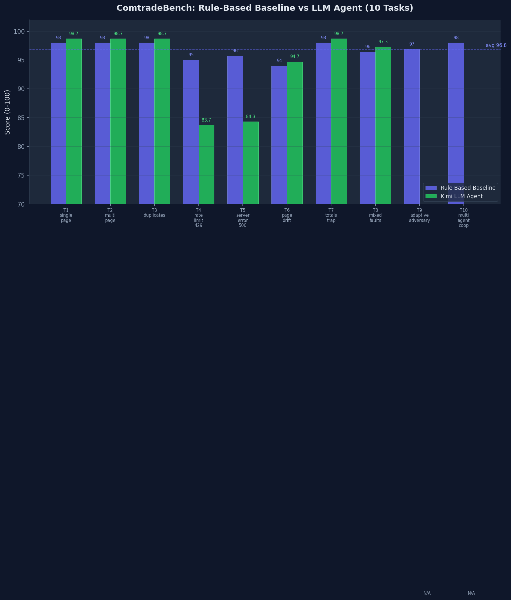

# ComtradeBench

### An OpenEnv Benchmark for Reliable LLM Tool-Use Under Adversarial API Conditions

ComtradeBench is a ten-task [OpenEnv](https://github.com/meta-pytorch/OpenEnv) environment that
measures **execution reliability** of LLM agents in a realistic API workflow. The domain is trade
data retrieval; the benchmark is about whether an agent can handle the failure modes that appear in
every production API at scale — pagination drift, duplicate records, transient errors, misleading
summary rows, and constrained request budgets.

The environment is **adversarial by design**: fault injection, non-stationary dynamics, and
multi-dimensional scoring reward correct execution, not fluent output.

**AgentBeats Phase 2 — OpenEnv Challenge** | Author: MateFin  
[GitHub](https://github.com/yonghongzhang-io/comtrade-openenv) ·
[HF Space](https://huggingface.co/spaces/yonghongzhang/comtrade-env) ·
[Blog](https://huggingface.co/yonghongzhang/ComtradeBench-Blog)

---

## What makes this benchmark different

Most API-task benchmarks evaluate whether an agent retrieves the correct answer from a clean API.
ComtradeBench evaluates whether the agent executes correctly when the API actively resists correct
execution:

- `T3`, `T8`: cross-page duplicate records can overcount rows and inflate trade totals.
- `T4`, `T8`: HTTP 429 rate limits can create missing pages if the agent advances too early.
- `T5`: HTTP 500 transient failures can leave silent data gaps when retry is skipped.
- `T6`: non-deterministic page ordering breaks agents that assume stable row position.
- `T7`: synthetic totals rows (`is_total=true`) contaminate aggregates unless filtered.
- `T9`: adaptive fault escalation tests whether policy still holds under mid-episode shift.
- `T10`: a halved request budget exposes redundant fetches and incomplete retrieval plans.

The agent has three MCP tools and 100 requests. The six-dimensional judge scores correctness,
completeness, robustness, efficiency, data quality, and observability. There is no partial credit
for correct-sounding output from an incorrect execution.

## Project Structure

```
comtrade_env/
├── README.md                    # This file
├── blog_post.md                 # Submission blog post
├── openenv.yaml                 # OpenEnv manifest
├── pyproject.toml               # Environment dependencies
├── Dockerfile                   # Container image
├── __init__.py                  # Module exports
├── client.py                    # ComtradeEnv HTTP/WebSocket client
├── models.py                    # ComtradeAction / ComtradeObservation
├── server/                      # Environment + mock service
│   ├── app.py                   # FastAPI app (HTTP + WebSocket)
│   ├── comtrade_env_environment.py  # Core MCP environment logic
│   ├── tasks.py                 # Task definitions (T1–T10)
│   ├── judge.py                 # Scoring engine (6 dimensions)
│   ├── mock_service/            # Embedded mock Comtrade API
│   │   ├── app.py               # FastAPI mock with fault injection
│   │   └── fixtures/            # Ground-truth data (seeded RNG)
│   ├── Dockerfile               # Server container image
│   └── requirements.txt
├── green/                       # Green Agent (A2A evaluator for AgentBeats)
│   ├── agent_a2a.py             # A2A server (JSON-RPC 2.0)
│   ├── judge_green.py           # Scoring engine
│   ├── tasks_green.py           # Task definitions
│   └── Dockerfile               # Green agent container
└── agent/                       # LLM training agent
    ├── agent.py                 # LLM-powered agentic loop
    ├── env_client.py            # InProcessEnvClient (no HTTP needed)
    ├── train_grpo.py            # GRPO training pipeline
    ├── smoke_test.py            # Rule-based smoke test (no LLM)
    ├── direct_test.py           # Direct environment test
    ├── inference.py             # Inference script
    ├── plot_training.py         # Training curve visualisation
    └── tests/
        └── test_comtrade.py     # Unit + integration tests
```

## Tasks (T1–T10)

| ID | Name | Challenge |
|----|------|-----------|
| T1 | Single page | Fetch one page, submit. Baseline correctness. |
| T2 | Multi-page pagination | Iterate pages until `has_more=False`. |
| T3 | Deduplication | Pages overlap; agent must dedup by primary key. |
| T4 | HTTP 429 retry | Rate-limit fault injection; retry without data loss. |
| T5 | HTTP 500 retry | Server error fault; retry transient failures. |
| T6 | Page drift | Non-deterministic page ordering; handle instability. |
| T7 | Totals trap | Summary rows mixed in; drop `is_total=true` rows. |
| T8 | Mixed faults | 429 rate-limit + cross-page duplicates simultaneously. |
| **T9** | **Adaptive adversary** | **Faults escalate mid-episode based on agent progress.** |
| **T10** | **Constrained budget** | **Single agent runs under halved request budget.** |

## MCP Tools

```
get_task_info()       → task description, query params, request budget
fetch_page(page, page_size)  → {rows, page, total_pages, has_more}
submit_results(data_jsonl, metadata_json, run_log)  → {reward, score, breakdown}
```

## Scoring (0–100 → reward 0.0–1.0)

| Dimension | Weight | What it measures |
|-----------|--------|-----------------|
| Correctness | 30 | All expected rows present and correct |
| Completeness | 15 | No missing records |
| Robustness | 15 | Correct handling of 429/500 faults |
| Efficiency | 15 | Request count relative to minimum needed |
| Data Quality | 15 | No duplicates, no totals rows leaked |
| Observability | 10 | `run.log` contains required fields |

## Quick Start

### 1. Smoke Test (no LLM required)

```bash
cd comtrade_env

# Install OpenEnv framework (if not already)
pip install openenv-core[core]

# Run rule-based agent on one task
python agent/smoke_test.py --task T1_single_page

# Run all tasks
for t in T1_single_page T2_multi_page T3_duplicates \
         T4_rate_limit_429 T5_server_error_500 T6_page_drift T7_totals_trap \
         T8_mixed_faults T9_adaptive_adversary T10_constrained_budget; do
    python agent/smoke_test.py --task $t
done
```

### 2. Run Tests

```bash
cd comtrade_env
pip install pytest
python -m pytest agent/tests/ -v
```

### 3. GRPO Training

```bash
cd comtrade_env

# Install agent dependencies
pip install torch transformers accelerate peft trl openai requests fastmcp fastapi uvicorn

# Using a local Ollama/vLLM endpoint (rollout-only, no gradient updates)
python agent/train_grpo.py \
    --api-url http://localhost:11434/v1 \
    --api-model qwen2.5:7b \
    --num-iterations 200 \
    --batch-size 4 \
    --group-size 4

# Using a HuggingFace model (full GRPO training with gradients)
python agent/train_grpo.py \
    --hf-model Qwen/Qwen2.5-7B-Instruct \
    --num-iterations 200
```

No external OpenEnv server is needed — `InProcessEnvClient` runs the environment in-process.

### 4. Run the OpenEnv Server (Docker)

```bash
cd comtrade_env
docker build -t comtrade-env:latest -f server/Dockerfile .
docker run -p 8000:8000 comtrade-env:latest
```

### 5. Deploy to Hugging Face Spaces

```bash
openenv push --repo-id <your-hf-org>/comtrade-bench
```

## Key Design Decisions

- **In-process environment**: `InProcessEnvClient` bypasses HTTP entirely for training, avoiding serialisation overhead and 422 errors from the typed `/step` endpoint.
- **Episode isolation**: Each rollout worker gets its own `InProcessEnvClient`. The mock service keys state by `(task_id, episode_id)` to prevent leakage between concurrent agents.
- **Thread-safe mock startup**: A module-level lock + event prevents port conflicts when multiple `ComtradeEnvironment` instances initialise in parallel.
- **GRPO correctness**: `old_log_probs` collected under `no_grad` before each gradient step, ensuring `ratio != 1` and clipping actually activates.
- **Robust tokenisation**: `tokenise_trajectories` uses `add_special_tokens=False` with BOS probe to correctly split prompt/completion regardless of tokenizer quirks.

## Results

### Rule-Based Baseline (no LLM)

| Task | Score | Reward |
|------|-------|--------|
| T1 Single page | 98.0 | 0.980 |
| T2 Multi-page | 98.0 | 0.980 |
| T3 Duplicates | 98.0 | 0.980 |
| T4 Rate limit | 95.0 | 0.950 |
| T5 Server error | 95.7 | 0.957 |
| T6 Page drift | 94.0 | 0.940 |
| T7 Totals trap | 98.0 | 0.980 |
| T8 Mixed faults | 96.4 | 0.964 |
| T9 Adaptive adversary | 96.9 | 0.969 |
| T10 Constrained budget | 98.0 | 0.980 |
| **Average** | **96.8** | **0.968** |



### GRPO Training Curve (8 iterations, real LLM)


### LLM Agent (Moonshot V1-8K via Kimi API, published T1-T8 subset)

The published `llm_results_kimi.json` snapshot covers the shared T1-T8 subset only. T9 and T10
remain baseline-only in this release, so the comparison column below is scoped to the shared tasks.

| Task | Score | Reward | Delta vs baseline (pts) |
|------|-------|--------|-------------------------|
| T1 Single page | 98.7 | 0.987 | +0.7 |
| T2 Multi-page | 98.7 | 0.987 | +0.7 |
| T3 Duplicates | 98.7 | 0.987 | +0.7 |
| T4 Rate limit | 83.7 | 0.837 | -11.3 |
| T5 Server error | 84.3 | 0.843 | -11.4 |
| T6 Page drift | 94.7 | 0.947 | +0.7 |
| T7 Totals trap | 98.7 | 0.987 | +0.7 |
| T8 Mixed faults | 97.3 | 0.973 | +0.9 |
| **Average (shared T1-T8 scope)** | **94.4** | **0.944** | **-2.2** |

## License

Environment code follows the OpenEnv BSD-style license.
Agent training code is provided as-is for the AgentBeats competition.
