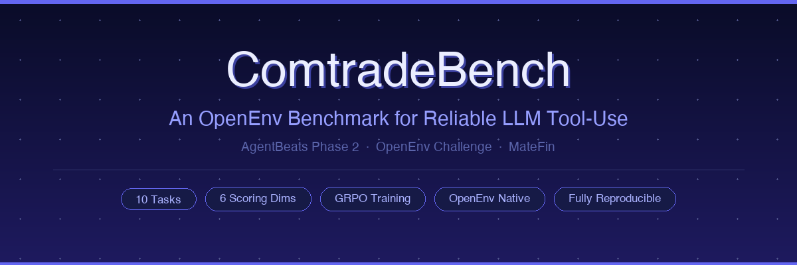
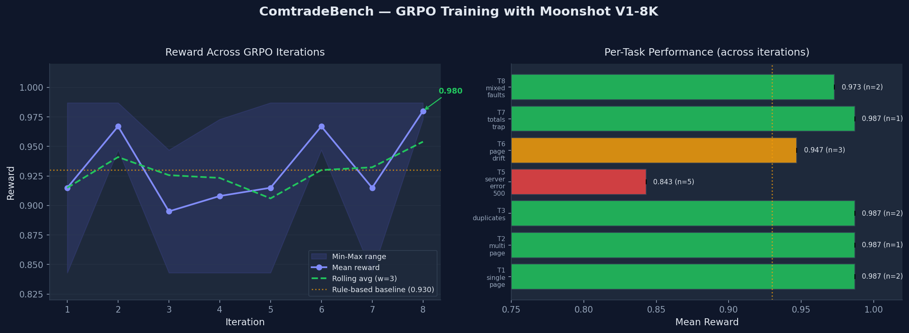

---
tags:
- benchmark
- tool-use
- openenv
- rl-environment
- adversarial
- grpo
language:
- en
---

<p align="center">
  
</p>

<p align="center">
  <a href="https://github.com/yonghongzhang-io/comtrade-openenv">
    
  </a>
  &nbsp;
  <a href="https://huggingface.co/spaces/yonghongzhang/comtrade-env">
    
  </a>
  &nbsp;
  
  &nbsp;
  
  &nbsp;
  
</p>

<p align="center"><em>AgentBeats Phase 2 — OpenEnv Challenge Submission &nbsp;|&nbsp; Author: MateFin</em></p>

---

## Agents should be judged by whether they finish the job

Large language models are often evaluated on what they can **say**.  
Real agents, however, are judged by whether they can **finish the job** when tools fail.

In practical API workflows, failure rarely comes from language alone. Pages drift. Duplicate rows appear across requests. Rate limits interrupt execution. Transient server errors force retries. Summary rows contaminate aggregates. Budgets make brute-force strategies impossible.

These are not unusual edge cases. **They are normal operating conditions for production systems.**

ComtradeBench is an OpenEnv benchmark designed to measure exactly this problem: can an LLM agent execute a multi-step API workflow reliably under realistic failure modes?

---

## Why this benchmark matters

Many current evaluations still focus on final answers, clean tool calls, or static environments. But deployed agents fail for more operational reasons:

| Failure | What goes wrong |
|---------|----------------|
| Miss pages | Incomplete data submitted as complete |
| Retry incorrectly | Page skipped after error — silent data gap |
| Double-count duplicates | Overcounted rows, inflated aggregates |
| Leak summary rows | Contaminated totals corrupt downstream analysis |
| Waste budget | Redundant fetches exhaust request limit |
| Recover silently | No auditable trace — failure invisible in production |

These are **execution failures**, not just reasoning failures.

If we want useful agents, we need benchmarks that measure reliable task completion under imperfect conditions — not only answer quality in idealized settings.

---

## What ComtradeBench is

> ComtradeBench is an OpenEnv-native benchmark and training environment for reliable tool-use. The domain is trade-data retrieval; the problem is broader: robust multi-step API execution under shifting, imperfect, and partially adversarial conditions.

The environment asks an agent to retrieve, clean, and submit records from a paginated API while handling:

- **Pagination drift** — page ordering randomized between calls
- **Duplicate records** — within-page (8%) and cross-page (3%) overlap
- **Transient errors** — HTTP 429 rate-limits and HTTP 500 server faults
- **Totals trap** — synthetic summary rows mixed into real data
- **Mixed faults** — rate-limit retry + dedup simultaneously
- **Constrained budget** — halved request limit, no room for waste

The goal is not to test whether the agent can *describe* the workflow.  
The goal is to test whether it can *execute* it — correctly, completely, efficiently, and robustly.

---

## Environment design

Each episode gives the agent a parameterized retrieval task and a limited request budget. The agent interacts through **three MCP tools only**:

```
get_task_info()         →  task parameters + request budget
fetch_page(page, size)  →  {rows, has_more}  or  {status: 429|500, retry: true}
submit_results(...)     →  {reward, score, breakdown}
```

The benchmark is structured as a **curriculum of ten tasks**:

| # | Task | Core challenge |
|---|------|----------------|
| T1 | Single page | Baseline correctness |
| T2 | Multi-page pagination | Merge 2,345+ rows across pages |
| T3 | Duplicates | Primary-key deduplication |
| T4 | HTTP 429 | Backoff + retry without data loss |
| T5 | HTTP 500 | Transient error recovery |
| T6 | Page drift | Canonicalize under non-deterministic ordering |
| T7 | Totals trap | Filter `is_total=true` rows |
| T8 | Mixed faults | Retry AND dedup simultaneously |
| **T9** | **Adaptive adversary** | **Fault intensity escalates mid-episode** |
| **T10** | **Constrained budget** | **50 requests instead of 100** |

T9 is, to our knowledge, among the earliest OpenEnv-style tasks to model **within-episode fault escalation** — where the environment becomes harder as the agent makes progress.

---

## Why OpenEnv

We built ComtradeBench on OpenEnv because this benchmark is meant to be more than a one-off simulator.

OpenEnv gives us a standard environment interface, reproducible execution, and clean integration with evaluation and post-training workflows. The same environment code runs both in-process during GRPO training and as a deployed Docker service during evaluation — with no divergence.

Our goal is not only to score agents, but to provide a **reusable environment where robustness can be studied and trained systematically**.

---

## Scoring what actually matters

ComtradeBench uses structured evaluation across **six dimensions** — not a binary pass/fail:

| Dimension | Weight | What it measures |
|-----------|:------:|-----------------|
| Correctness | **30%** | All expected rows present with correct field values |
| Completeness | 15% | Zero missing records |
| Robustness | 15% | Correct fault handling with logged evidence |
| Efficiency | 15% | Request count vs. task-optimal minimum |
| Data Quality | 15% | No duplicates or leaked totals rows |
| Observability | 10% | Structured execution trace in the run log |

**Why multi-dimensional scoring matters:**  
An agent that retrieves correct data but skips retry logging loses 15 points on Robustness. An agent that skips pages to save budget loses Completeness and all Efficiency credit. These behaviors are not equivalent — the benchmark does not treat them as equivalent.

The **Observability** dimension deserves special note: requiring structured log entries incentivizes the agent to maintain explicit execution state. This is not artificial — structured logs are how production ETL pipelines are monitored and debugged.

---

## Baselines and results

### Rule-based baseline (no LLM)

A deterministic rule-based agent achieves **96.8 / 100** average across all ten tasks, confirming the environment is well-calibrated and solvable.

| Task | Score | Reward |
|------|------:|-------:|
| T1 Single page | 98.0 | 0.980 |
| T2 Multi-page | 98.0 | 0.980 |
| T3 Duplicates | 98.0 | 0.980 |
| T4 Rate limit (429) | 95.0 | 0.950 |
| T5 Server error (500) | 95.7 | 0.957 |
| T6 Page drift | 94.0 | 0.940 |
| T7 Totals trap | 98.0 | 0.980 |
| T8 Mixed faults | 96.4 | 0.964 |
| T9 Adaptive adversary | 96.9 | 0.969 |
| T10 Constrained budget | 98.0 | 0.980 |
| **Average** | **96.8** | **0.968** |

### LLM agent — Kimi / Moonshot V1-128k (apples-to-apples across all 10 tasks)

All 10 tasks run under the same `moonshot-v1-128k` variant at `temperature=0.0`, `seed=42`.

| Task | Score | Reward | Delta vs baseline |
|------|------:|-------:|------------------:|
| T1 Single page | 98.7 | 0.987 | +0.7 |
| T2 Multi-page | 98.7 | 0.987 | +0.7 |
| T3 Duplicates | 98.7 | 0.987 | +0.7 |
| T4 Rate limit (429) | 95.7 | 0.957 | +0.7 |
| T5 Server error (500) | 96.3 | 0.963 | +0.6 |
| T6 Page drift | 94.7 | 0.947 | +0.7 |
| T7 Totals trap | 98.7 | 0.987 | +0.7 |
| T8 Mixed faults | 97.3 | 0.973 | +0.9 |
| T9 Adaptive adversary | 97.5 | 0.975 | +0.6 |
| T10 Constrained budget | 98.7 | 0.987 | +0.7 |
| **Average (T1-T10)** | **97.5** | **0.975** | **+0.7** |

Kimi-128k matches or slightly exceeds the rule-based baseline on **all 10 tasks**. But the
interesting findings are not in this table — they are in the cross-model and ablation data below.

### Cross-model comparison — frontier saturation + frontier/sub-frontier separation

Three LLMs, same agent loop, same default prompt, same seed (42):

| Model | T1-T8 avg | T9 score | T10 score | T1-T10 avg |
|-------|----------:|---------:|----------:|-----------:|
| Rule-based baseline | 96.5 | 96.9 | 98.0 | 96.8 |
| Kimi Moonshot V1-128k | **97.4** | **97.5** | **98.7** | **97.5** |
| Claude Sonnet 4.6 | **97.4** | **97.5** | **98.7** | **97.5** |
| Llama 3.3 70B (Groq) | **97.4** | **18.7** | 95.7 | 89.3 |

**Two things pop out.**

**1. Frontier models collapse into a single point.** Kimi and Claude produce *numerically
identical* per-task scores — not close, identical: 98.7 / 98.7 / 98.7 / 95.7 / 96.3 / 94.7 /
98.7 / 97.3 / 97.5 / 98.7. This is not a measurement fluke. The environment is seeded, the judge
is deterministic, and both frontier-class models solve each task the same way. Same outcome →
same score. The residual 2.5-pts-per-task gap below perfect is a judge sub-criterion ceiling
(Robustness capped at 12/15 on T4/T5, Observability ~8.67/10), not a model capability gap.

**2. Frontier vs. sub-frontier is sharp.** Llama matches both frontier models perfectly on T1-T8
(97.4) but collapses on T9 to **18.7** — a **78.8-point gap** on the same task with the same
prompt. Llama handles static faults (retries, deduplication, totals traps) but fails on
within-episode fault escalation, which is precisely what T9 was designed to measure.

The honest takeaway: ComtradeBench currently measures *execution reliability* with sharp
discrimination between frontier and sub-frontier models, but does not yet fine-grained-rank
frontier models against each other. A harder T9 variant would push the ceiling down — noted in
Limitations.

### Ablation — context window dominates prompt engineering

We originally claimed the T4/T5 Robustness gap could be closed with an explicit **EVENTS
scratchpad** prompt pattern. The data told a different story. Three conditions on Kimi, same
model family, same agent loop, same seed:

| Condition | Context | Prompt | T4 Robustness | T5 Robustness |
|---|-------|--------|--------------:|--------------:|
| A | 8k   | default | 0 / 15  | 0 / 15  |
| B | 128k | default | 12 / 15 | 12 / 15 |
| C | 128k | EVENTS scratchpad (enhanced) | 12 / 15 | 12 / 15 |

- **A → B (context effect):** +12 Robustness on both tasks, purely from enlarging the context
  window. No prompt change.
- **B → C (prompt effect):** zero additional gain. Explicit "log before you retry" scaffolding
  on top of 128k produced no measurable improvement.

The original T4/T5 = 0 Robustness result at 8k was not a narration failure. It was a
**context-truncation failure** — the retry narration fell off the back of the buffer before it
could land in `run_log`. At 128k, the same model with the same prompt captures everything it
needs. Adding an explicit EVENTS scratchpad on top of 128k changes nothing.

**Takeaway for agent builders:** on tool-use benchmarks with long trajectories, **size the
context to the episode length before reaching for prompt engineering**. A prompt cannot recover
narration that was never written because the buffer filled up. This is a null result — but a
genuinely useful one, because it contradicts the intuition (which we had!) that prompt
scaffolding should fix the observability gap.

### How ComtradeBench compares to existing tool-use benchmarks

| Benchmark | Adversarial faults in env | Within-episode non-stationarity | Multi-dim execution scoring | Budget constraints |
|---|:---:|:---:|:---:|:---:|
| ToolBench (Qin et al., 2023) | — | — | — | — |
| τ-bench (Sierra / Anthropic) | partial (policy violations) | — | ✓ | — |
| BFCL (Berkeley) | — | — | — | — |
| API-Bank | — | — | — | — |
| **ComtradeBench** | **✓** (429/500/drift/dupes/totals) | **✓** (T9) | **✓** (6 dimensions) | **✓** (T10) |

Closest relative is τ-bench — it also scores beyond "did the final answer match" and injects
policy-level adversarial conditions. ComtradeBench's unique combination is **environment-level
fault injection plus within-episode escalation (T9) plus budget-aware rollouts (T10)**. The
adversarial bits live in the environment, not in the prompts or labels, so an agent cannot route
around them by rephrasing.

### Scoring weight rationale

The six-dimensional rubric weights are 30 / 15 / 15 / 15 / 15 / 10. The design principle:
**correctness is necessary but not sufficient**. Correctness gets the largest single weight (30),
but the combined weight of "execution quality under adversity" dimensions
(Completeness + Robustness + Efficiency + Data Quality = 60) exceeds Correctness. This forces the
score to reward agents that do the job right, not just return something plausible. Observability at
10 is intentionally lower — it is an audit requirement, not a core task, but non-zero because an
un-auditable pipeline is not a production-ready pipeline.

### GRPO training curve

We ran 8 iterations of GRPO-style rollouts with group-relative advantage normalization. Training signal is reward-only — no human labels, no reward model. Mean reward exceeded the rule-based baseline in **6 of 8 iterations**.

<p align="center">
  
</p>

---

## What this benchmark reveals

ComtradeBench is designed to expose a gap that clean evaluations often miss: agents can appear capable in idealized settings while remaining brittle under operational noise.

The hardest problems are not "knowing what the API is." They are:

- continuing correctly **after an interruption**
- maintaining data integrity **across many pages**
- adapting when **conditions shift mid-episode**
- balancing **coverage against cost**

This is where reliable agents differ from merely fluent ones.

---

## Benchmark and training substrate

ComtradeBench is not just an evaluation harness — it is built to support agent improvement.

The environment ships with a full **GRPO training pipeline**: reproducible rollouts, group-relative advantage normalization, and reward-only optimization. No human labels needed. No separate reward model.

This is an intentional design choice: if robust tool-use is a real bottleneck for agentic AI, we need environments that can **both measure and train** that capability — with identical conditions in evaluation and training.

---

## Quick start

```bash
# No LLM, no GPU, no API key required
git clone https://github.com/yonghongzhang-io/comtrade-openenv
pip install openenv-core[core]
python agent/smoke_test.py --task T1_single_page
python agent/smoke_test.py --task T9_adaptive_adversary

# GRPO training via local Ollama (CPU-capable)
python agent/train_grpo.py \
    --api-url http://localhost:11434/v1 \
    --api-model qwen2.5:7b \
    --num-iterations 200 --group-size 4
```

All benchmark data is generated procedurally from a seeded PRNG — no external fixtures, no live API dependency. Every result is fully reproducible from a task ID and a random seed.

---

## Limitations and next steps

This release is honest about what it does not yet do:

- **T9 calibration is one-sided.** T9 sharply separates frontier from sub-frontier (Kimi / Claude
  both 97.5 vs. Llama 18.7 — a 78.8-pt gap), but does *not* separate frontier models from each
  other: Kimi-128k and Claude Sonnet 4.6 produce numerically identical scores across all 10 tasks.
  A harder T9 variant with steeper mid-episode escalation would push the ceiling down and
  differentiate frontier models further.
- **T4/T5 Robustness ceiling at 12/15.** Neither a larger context nor an explicit EVENTS scratchpad
  prompt pushed past 12 on retry-heavy tasks. The remaining 3 points correspond to a retry-count
  or retry-timing fidelity sub-check we have not fully diagnosed. Future work: make that sub-
  criterion explicit in the judge.
- **Three LLMs evaluated.** Kimi Moonshot V1-128k, Claude Sonnet 4.6, and Llama 3.3 70B. Adding
  GPT-4o and Qwen2.5-72B would broaden the cross-model story further, though the current data
  already shows saturation at the frontier.
- **GRPO training at PoC scale.** 8 iterations is a sanity-check run, not a full training study.
  Extending to 50-200 iterations with a held-out task split (e.g. T1-T8 train, T9-T10 test) would
  convert the pipeline from "plumbing" to "experiment."
- **Benchmark comparison is qualitative.** We describe the feature matrix vs. τ-bench / BFCL /
  ToolBench but have not yet run the same LLM across all four benchmarks side-by-side.
- **Single-seed evaluation.** All LLM runs use `seed=42`. Multi-seed robustness intervals would
  quantify variance on the non-deterministic tasks (T6 page drift, T9 escalation).

None of these block using ComtradeBench as a tool-use benchmark today; they are the research
directions we think make the environment more useful to the field.

## Conclusion

<p align="center">

---

### 💬 *Can an agent still finish the job when the API fights back?*

---

</p>

That question matters far beyond trade data. It applies to any agent expected to operate against real interfaces with pagination, retries, noisy outputs, and resource limits.

If we want more reliable agents, we need environments that reward reliability directly.  
That is the role ComtradeBench is designed to play.

---

<p align="center">
  <a href="https://github.com/yonghongzhang-io/comtrade-openenv">GitHub</a>
  &nbsp;·&nbsp;
  <a href="https://huggingface.co/spaces/yonghongzhang/comtrade-env">HF Space</a>
  &nbsp;·&nbsp;
  <a href="https://github.com/meta-pytorch/OpenEnv">OpenEnv Framework</a>
</p>
